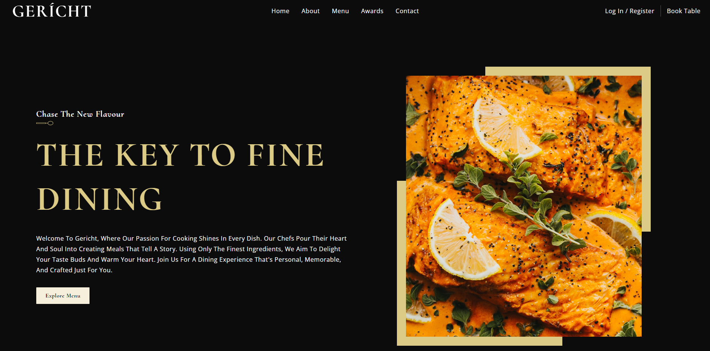

# Restaurant Website Showcase

Welcome to the repository for my restaurant website project! This project is a showcase of my frontend development skills using React. The website demonstrates my ability to create a visually appealing, responsive, and user-friendly interface for a restaurant.

You can view the live website here: [gerichtrestaurant.site](https://gerichtrestaurant.site)



## Table of Contents

- [Features](#features)
- [Technologies Used](#technologies-used)
- [Installation](#installation)

## Features

- **Responsive Design:** The website is fully responsive, providing an excellent user experience on both desktop and mobile devices.
- **Interactive UI:** Engaging and interactive user interface elements.
- **Dynamic Content:** Content is dynamically rendered using React components.
- **Navigation:** Smooth and intuitive navigation throughout the website.
- **Contact Form:** A functional contact form to connect with potential customers.
- **Photo Gallery:** An attractive photo gallery showcasing the restaurant's dishes.

## Technologies Used

- **React:** A JavaScript library for building user interfaces.
- **HTML5 & CSS3:** The standard technologies for creating and styling web pages.
- **JavaScript:** The programming language used to make the website interactive.
- **Bootstrap:** A CSS framework for responsive design (optional, if used).
- **Axios:** For handling HTTP requests (optional, if used).

## Installation

To run this project locally, follow these steps:

1. **Clone the repository:**
   ```sh
   https://github.com/attiamohmed/gericht_restaurant_website
